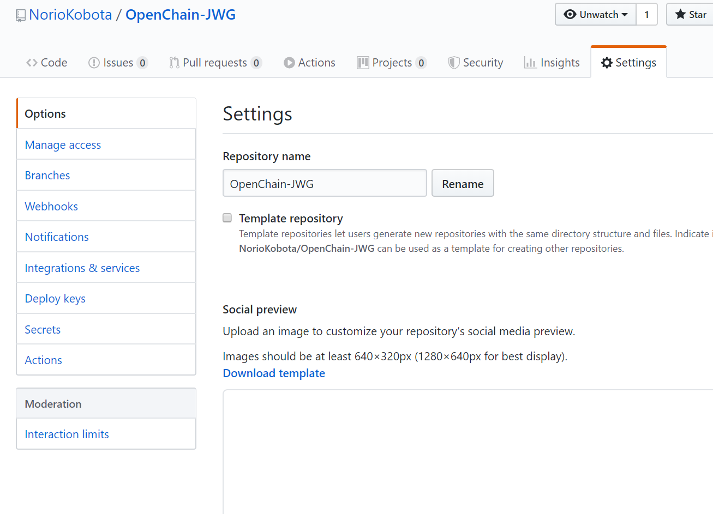
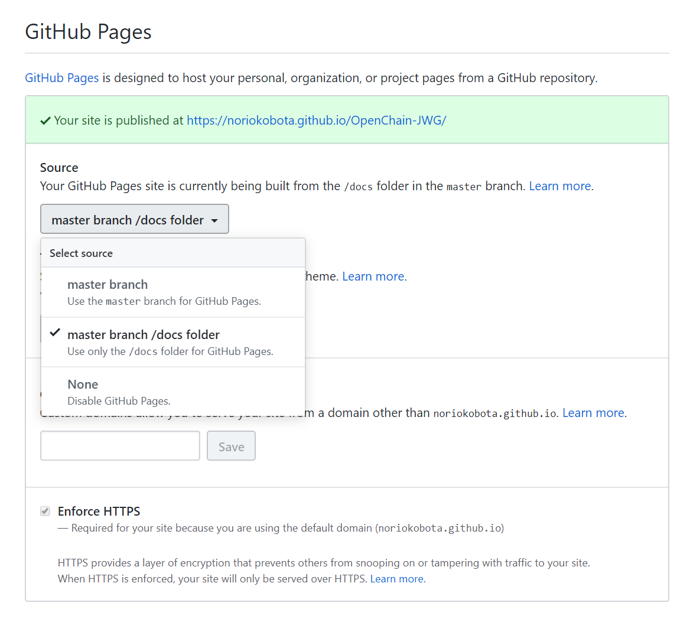
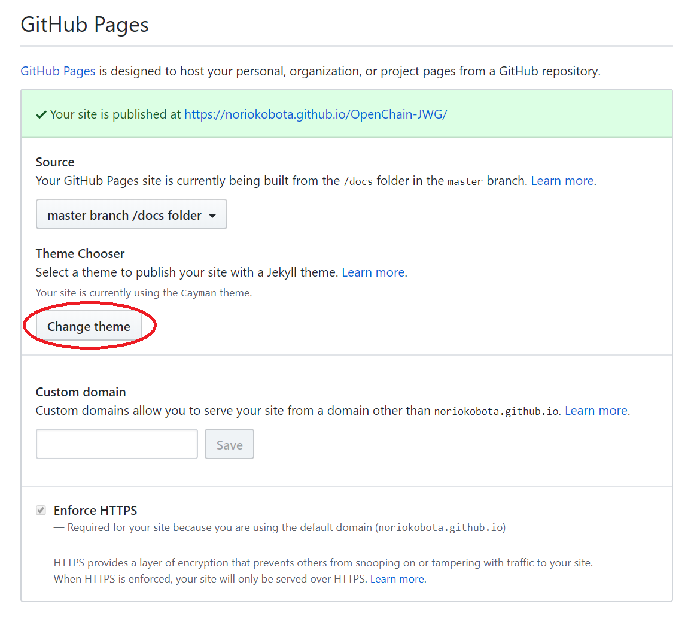

# README.1st

## Github Pagesへの移行方法案

1. https://github.com/OpenChain-Project に、OpenChain-JWGリポジトリを作成してもらう。  
   → 他国のgithubは全て、OpenChain-XXXという形式になっているのでそれに倣う。  
1. OpenChain-Project/OpenChain-JWG リポジトリが出来たら、docsフォルダを作成する。  
   index.mdがindex.htmlとして[jekyll](https://jekyllrb.com/)で変換されるので、index.mdを作成する。  
   > [OpenChain tooling WG](https://www.openchainproject.org/news/2019/07/25/openchain-launches-tooling-work-group)のMLでも意見が出ていたと思うが、[reStructuredText](https://www.sphinx-doc.org/ja/master/usage/restructuredtext/basics.html)など、どのフォーマットが良いのかは議論の余地あり。  
1. docsフォルダ以下をGithub Pagesとして扱う設定を行う。
   1. OpenChain-JWGリポジトリの```Settings```タブを管理者がクリック。  
     
   1. Settings->Github Pagesの **```Source```** を **```master branch/docs folder```** に変更する。  
   
   1. 必要であれば、 **```Change theme```** を行い、見栄えの良いthemeに変更する。なお、このサンプルは、[Cayman](https://pages-themes.github.io/cayman/)を利用している。  
   実体としては、[docs/_config.yml](https://github.com/NorioKobota/OpenChain-JWG/blob/master/docs/_config.yml)となる。その他設定に関しては、[Github Pagesのヘルプ](https://help.github.com/ja/github/working-with-github-pages/about-github-pages-and-jekyll)や、jekyllのマニュアル参照。  
   
1. 後は、docsフォルダ以下に、Websiteとなるコンテンツを(例えば)index.mdとして配置していく。  
ただし、[Github Pagesを試用するためのガイドライン](https://help.github.com/ja/github/working-with-github-pages/about-github-pages) に記載があるが、
   ```GitHub Pages ソースリポジトリには、1GB の推奨上限があります。```  
   なので、出来うる限り、index.mdなどtextベースのコンテンツのみをdocs以下には配置し、その他マテリアルは、その他ディレクトリに配置、リンクで飛ばすのが良いと思います。  
   また、アイコンについては、imageを利用するのではなく、絵文字を利用するのが楽だと思います。例えば、[こちらを参照](https://unicode.org/emoji/charts/full-emoji-list.html)。 **```Code```** に記載された文字コードが、```U+1F600```の場合は、```&#x1F600;```と記載することによって、絵文字が出ます。  
   最後に、既知の問題点として、会合で撮影した写真などを置く場所は別途考える必要がある。Githubを写真のストレージとして使うことは許諾されていないと思います。
1. 最終的なリポジトリのディレクトリ構成は以下のようになると良いかもしれません。  
   ```
   OpenChain-JWG +- docs-------+- index.md  
                 |             +- meetings -> 各回毎にdirectoryを分けて資料を配置。もしくはGeneralなどに配置して、link  
                 |             +- subgroups -> SWG毎にdir分けして資料配置。  
                 |             +- outcomes  -> Generalなどに配置して、link  
                 +- Onboarding : 今まで通り  
                 +- General    : 今まで通り  
   ```
## EOF
